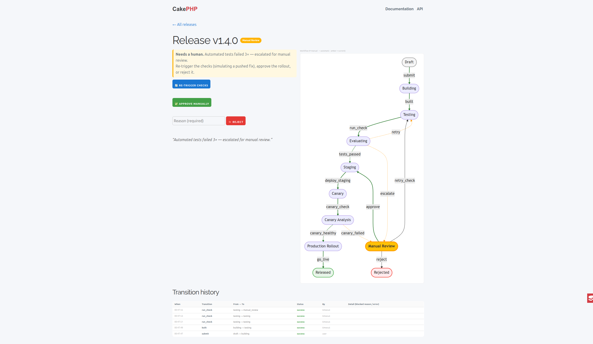
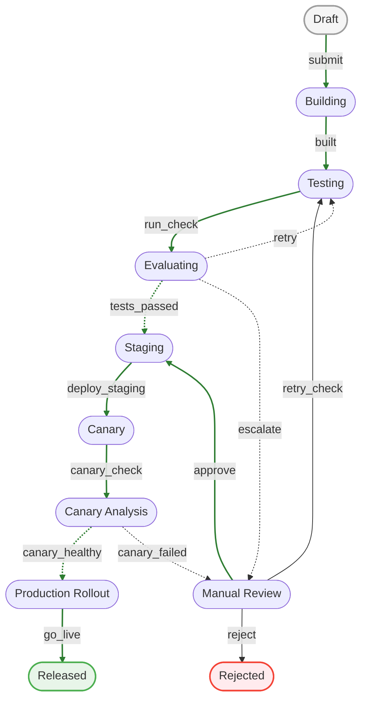

# CakePHP Workflow Demo — Software Release Pipeline

A small, runnable CakePHP 5 app that shows off [**dereuromark/cakephp-workflow**](https://github.com/dereuromark/cakephp-workflow)
with a realistic **software-release pipeline** — every kind of transition the engine supports, an interactive frontend,
and a live state diagram.



## Quick start (one command)

No database server needed — it runs on **SQLite**.

```bash
git clone https://github.com/dereuromark/cakephp-workflow-demo.git
cd cakephp-workflow-demo
make        # composer install + migrate + serve
```

Then open **<http://localhost:8765/releases>** and start a release.

> Requires PHP 8.4+ and Composer. `make` installs dependencies, creates the SQLite DB, runs the
> plugin + app migrations, and starts the dev server. Prefer to do it by hand?
> `composer install && composer setup && composer serve`.

## What it demonstrates

The `release` workflow is defined with PHP attributes in [`src/Workflow/Release/`](src/Workflow/Release).
It deliberately exercises **every** capability of the plugin:

| Capability | Where | What you see |
|---|---|---|
| **Manual transitions** (user-triggered) | `DraftState`, `ManualReviewState` | Buttons: *Submit*, *Re-trigger checks*, *Approve*, *Reject* |
| **Automatic transitions** (no event) | `EvaluatingState`, `CanaryEvalState` | `automatic: true` branches evaluated on entry |
| **Timeout transitions** ("fake sleep") | `Building`/`Testing`/`Staging`/`Canary`/`Production` | Each auto-step advances after a short delay |
| **Conditions** (branching) | `#[Condition]` methods | pass / retry / escalate, canary healthy / failed |
| **A retry loop** | `Testing → Evaluating → Testing` | Auto-checks run up to **3×**, then escalate |
| **Human-in-the-loop** | `ManualReviewState` | Pipeline parks for a person to decide |
| **Guards (a *blocked* outcome)** | `StagingState` `#[Guard]` | First deploy is blocked → release **stays in `staging`** → retries |
| **Command errors (an *error* outcome)** | `ProductionState` `#[Command]` throws | First rollout throws → logged as `error` → retries |
| **`#[RequireReason]`** | `ManualReviewState` reject | *Reject* requires a reason |
| **Audit log** | history table | Every attempt with status + `triggered_by` + blocked/error detail |
| **Live Mermaid diagram** | view page | Current state highlighted; ━ manual, ┄ automatic |

> **Is there a `manual = true` flag?** No — transitions are **manual by default** (a button/user triggers them).
> You opt *into* automatic behaviour with `#[Transition(automatic: true)]` or `#[Timeout(...)]`.

## The pipeline



Solid arrows are **manual or timeout** transitions; dashed arrows are **automatic** (condition-driven).
The **green** line is the happy path — a perfect run from `draft` all the way to `released`.

### A typical run

1. **Submit** (you) → the build/test pipeline starts auto-advancing.
2. **Testing** runs automated checks; they fail **3×** and the release **escalates to Manual Review**.
3. **Re-trigger checks** (you, simulating a pushed fix) → checks pass → **Staging**.
4. **Staging** deploy is **blocked** on the first try (a flaky-deploy guard) — the release *stays in `staging`* and retries.
5. **Canary** analysis is **unhealthy** on the first try → back to **Manual Review**.
6. **Approve** (you) → re-rollout → canary healthy → **Production**.
7. **Production rollout** **throws** on the first attempt (status `error`, visible in the history + `logs/error.log`) → retries → **Released**. 🎉

See **[docs/workflow.md](docs/workflow.md)** for a state-by-state walkthrough, the two attempt-tracking techniques
(a column vs. counting the audit log), and where `blocked` vs `error` details are stored.

## How it works under the hood

- **Auto-advance**: each timeout-driven step schedules a timeout; the view polls `GET /releases/run/{id}`,
  which fires any due timeouts (and retries `blocked`/`error` ones). This is the demo's stand-in for a real
  `bin/cake workflow timeouts` cron worker.
- **Persistence**: transitions go through the behaviour's `transition()` (save + audit log).
- **Database**: SQLite by default (see `config/app_local.example.php` to switch to MySQL).

## Key files

| File | Purpose |
|---|---|
| `src/Workflow/Release/*.php` | The state machine (one class per state, attribute-defined) |
| `src/Model/Table/ReleasesTable.php` | Attaches the `Workflow.Workflow` behaviour |
| `src/Controller/ReleasesController.php` | `index` / `view` / `add` / `transition` / `run` (the poll/tick) |
| `templates/Releases/` | The interactive frontend (diagram, buttons, history) |
| `config/Migrations/` | The `releases` table |

## License

MIT. The workflow plugin it demonstrates: <https://github.com/dereuromark/cakephp-workflow>.
